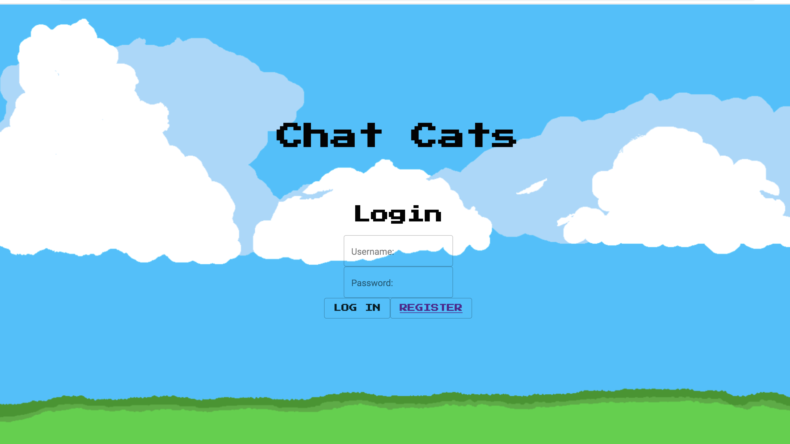
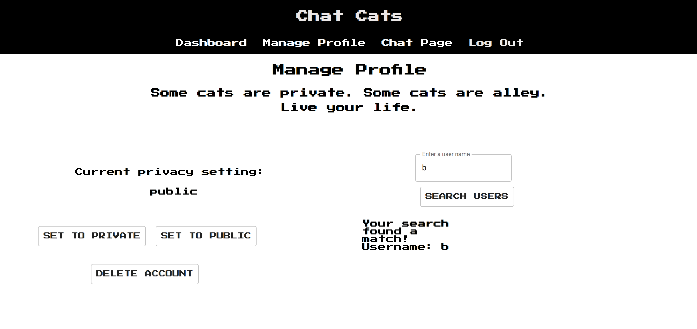
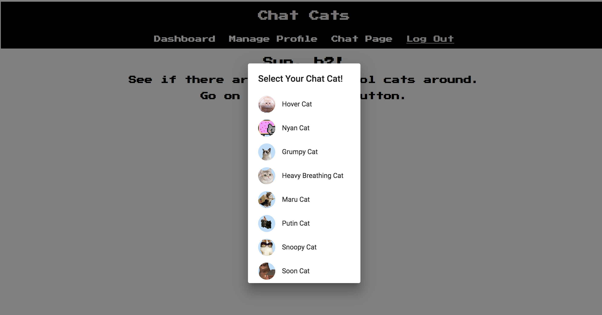
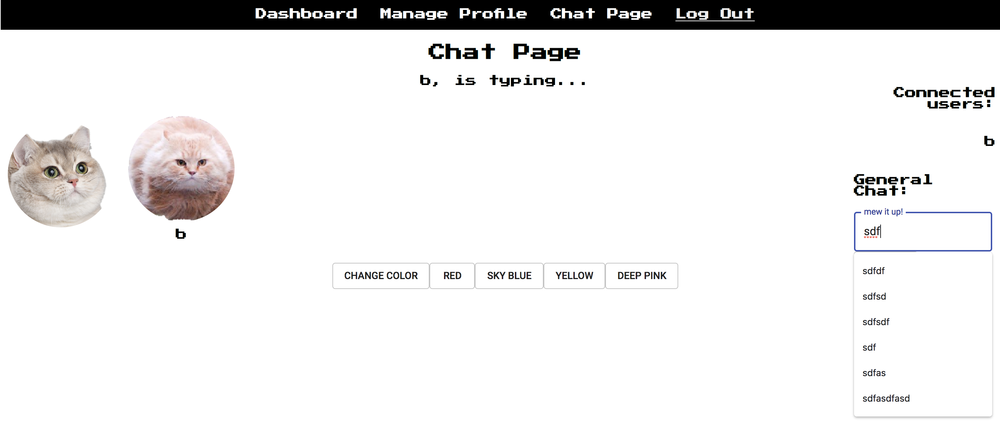

# Chat Cats
This is a CRUD application that also has a real-time chat feature utilizing websockets. A user can create an account, update privacy settings, search for other users by name and chat with anyone else logged into the app at the same time.

## Prerequisites
Before you get started, make sure you have the following software installed on your computer:

- [Node.js](https://nodejs.org/en/)
- [PostrgeSQL](https://www.postgresql.org/)
- [Nodemon](https://nodemon.io/)

## Create database and table
Download the repository.
Create a new database called `prime_app` and run the queries and alter's in the database.sql file.

If you would like to name your database something else, you will need to change `prime_app` to the name of your new database name in `server/modules/pool.js`


## Development Setup Instructions

* Run `npm install`
* Create a `.env` file at the root of the project and paste this line into the file:
    ```
    SERVER_SESSION_SECRET=secretLongString
    ```
    While you're in your new `.env` file, take the time to replace `secretLongString` with some long random string like `25POUbVtx6RKVNWszd9ERB9Bb6` to keep your application secure. Here's a site that can help you: [https://passwordsgenerator.net/](https://passwordsgenerator.net/). If you don't do this step, create a secret with less than eight characters, or leave it as `secretLongString`, you will get a warning.

* Start postgres if not running already by using `brew services start postgresql`
* Run `npm run server`
* Run `npm run client`
* Navigate to `localhost:3000`


## Navigation

* `src/` contains the React application
* `public/` contains static assets for the client-side
* `server/` contains the Express App

## Screen Shots

Landing Page


Edit Profile Page


Avatar Select Page with modal popup


Chat Page


